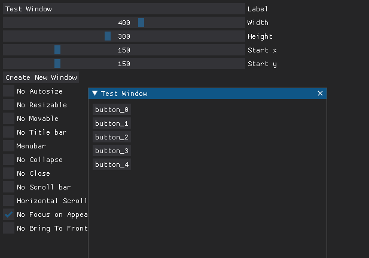
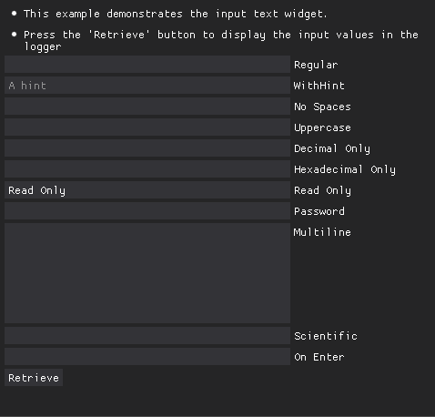
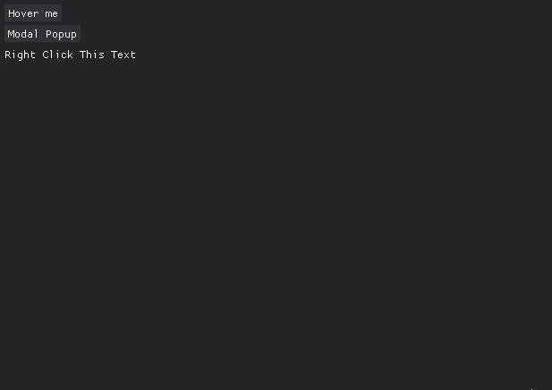
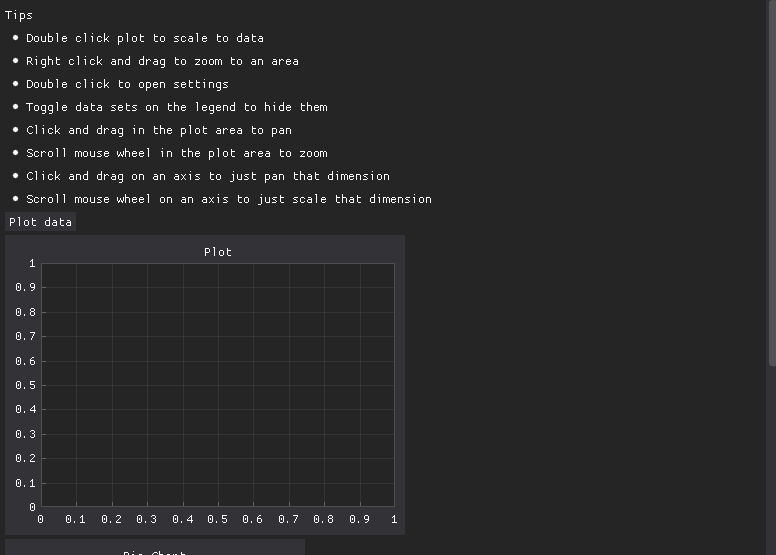
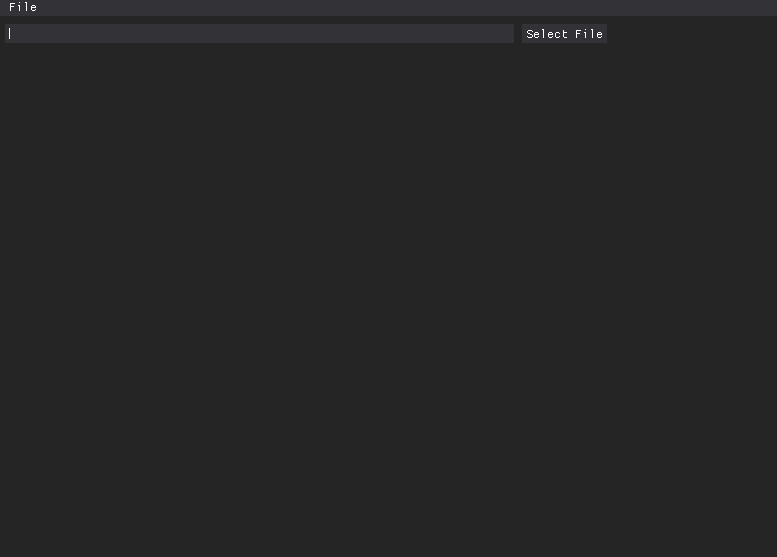
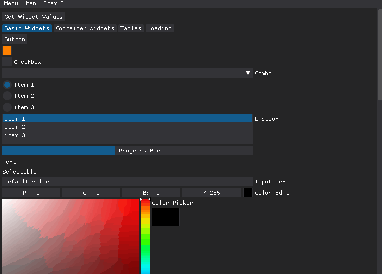

Morikatron Engineer Blog の記事 「」のサンプルコードです。  
詳しくはブログ記事を参照ください。

# Example
以下のプログラムを実行するには[Dear PyGui](https://github.com/hoffstadt/DearPyGui)が必要です。

## Window

[code](window_example.py)

## Input Text

[code](input_text_example.py)

## Tooltips & Popup

[code](tooltips_popup_example.py)

## Image

[code](image_example.py)

## Plot

[code](plot_example.py)

## Drawing

[code](drawing_example.py)

## FileDialog

[code](file_example.py)

## FileDialog (tkinterを利用する場合)

[code](file_example2.py)

## Widget

[code](widget_example.py)
